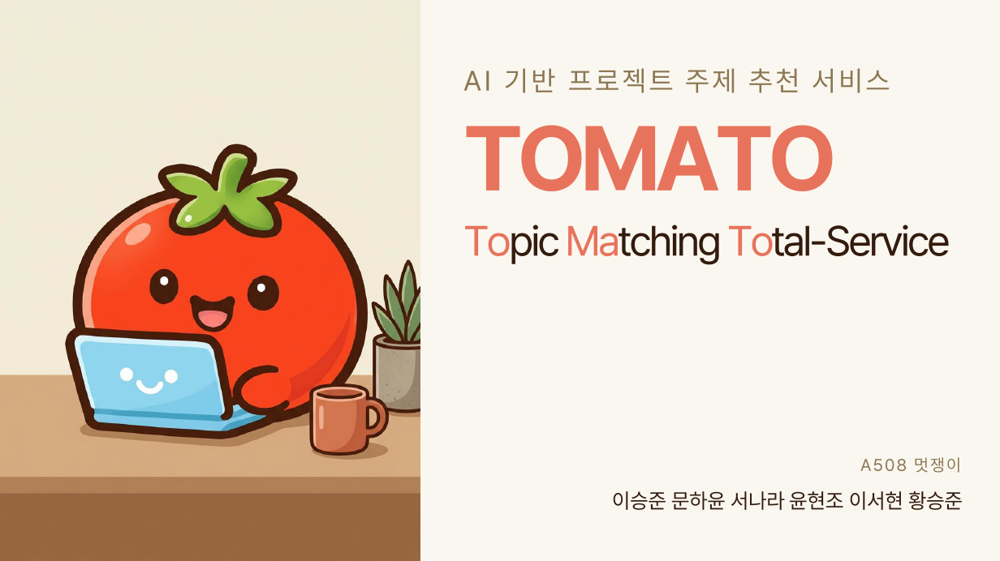
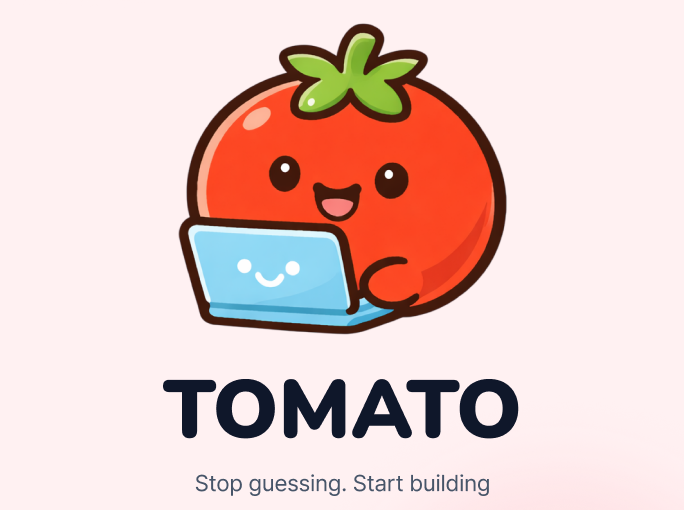
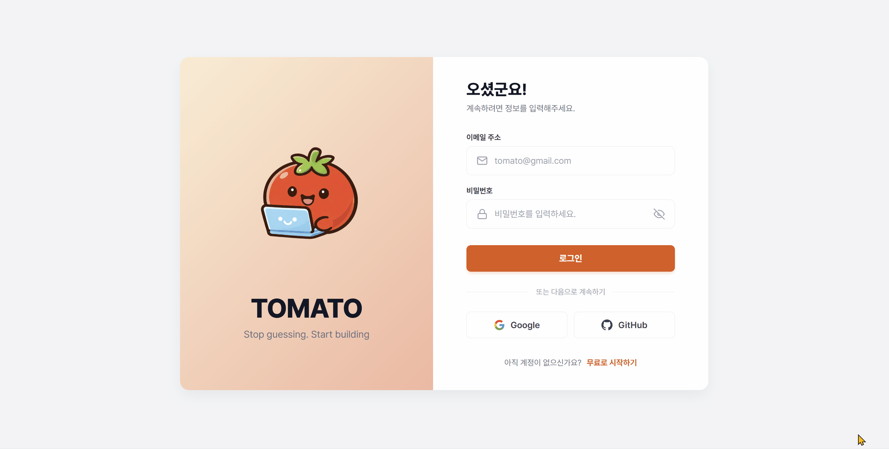
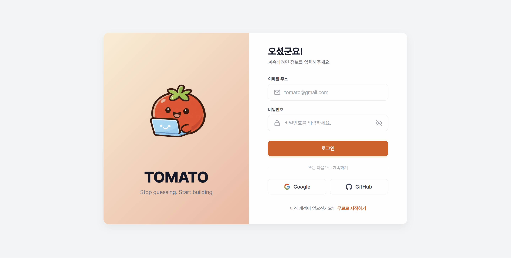
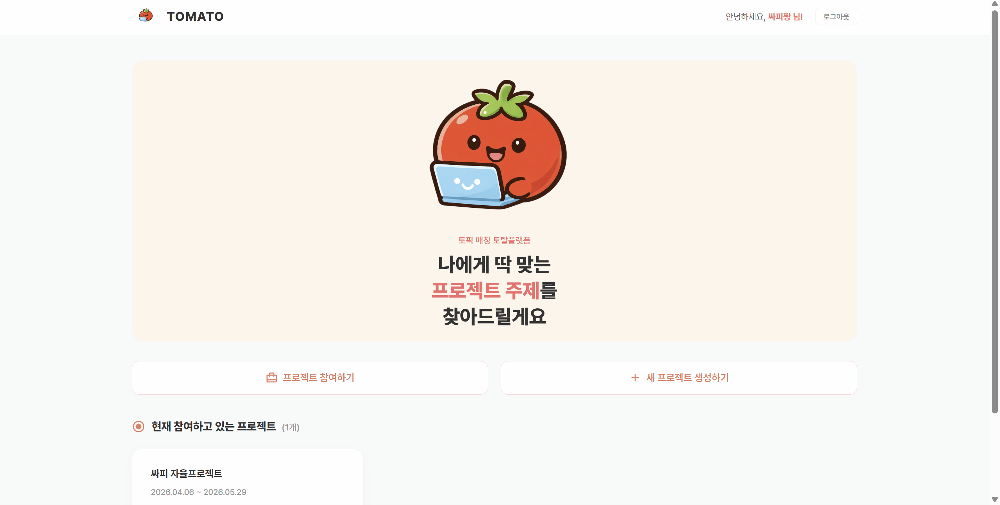
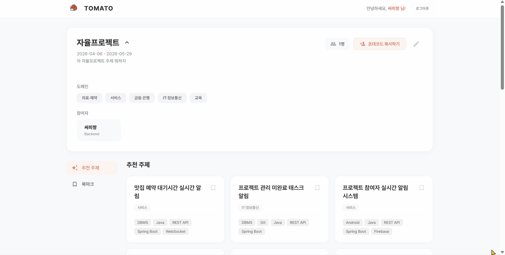
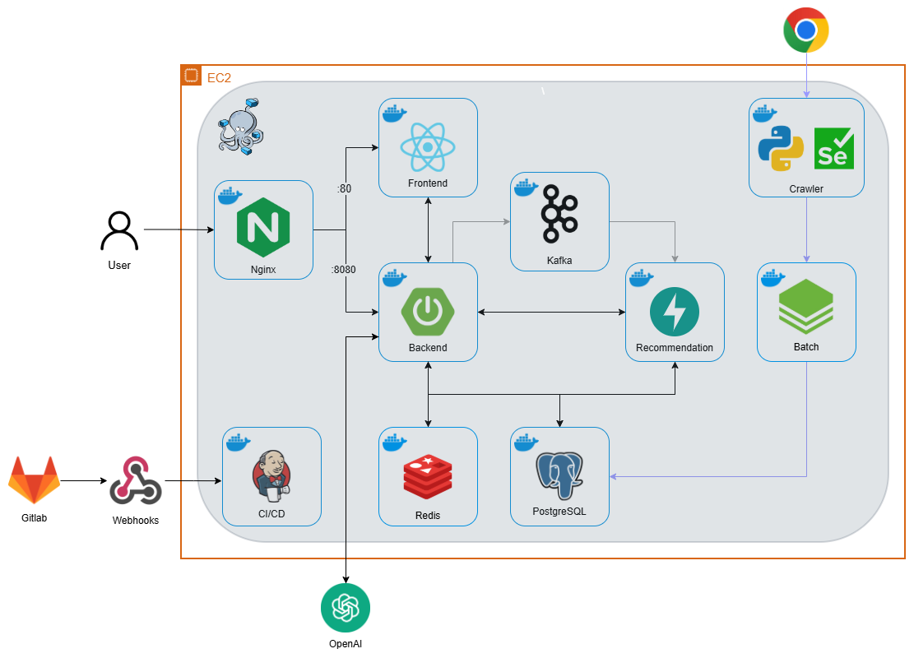

<div align="center">
    <h1>🍅 Tomato : AI 기반 프로젝트 주제 추천 서비스</h1>
    <p><b>삼성 청년 SW·AI 아카데미 14기</b></p>
    <p><b>특화 프로젝트 서울 5반 A508 </b></p>
</div>

---



## 💡 프로젝트 소개

프로젝트를 진행할 때 팀의 기술 스택뿐만 아니라 **관심 분야와 실제 행동 기반 선호도**가 결과의 완성도를 좌우합니다.  
**Tomato**는 단순한 기술 스택 매칭을 넘어, **팀원들의 행동 로그와 메타 정보를 함께 반영**하여 팀에 적합한 프로젝트 주제를 추천합니다.

팀원들의 기술 스택, 관심 분야, 활동 데이터를 기반으로 **팀 단위 프로필을 구성하고 이를 벡터화**하여  
가장 적합한 프로젝트 주제를 도출합니다.

또한, **사용자의 조회·클릭·관심 표현 등의 행동 로그를 실시간으로 반영**하여  
서비스를 사용할수록 더욱 정교해지는 **맞춤형 프로젝트 추천 경험**을 제공합니다.

### 🎬 소개 영상 (Google Drive 바로가기)

[](https://drive.google.com/file/d/1ivO8Qcpg3Ol3THElvhDwbCqELmOYKahY/view?usp=drive_link
)

---

## 📑 목차

1. [💡 프로젝트 소개](#-프로젝트-소개)
2. [💡 주요 기능 및 플랫폼](#-주요-기능-및-플랫폼)
3. [🗓️ 개발 일정](#️-개발-일정)
4. [📝 산출물](#-산출물)
5. [👨‍👩‍👧‍👦 개발 팀 소개](#-개발-팀-소개)
6. [🛠️ 기술 스택](#️-기술-스택)
7. [🖥️ 서비스 화면](#️-서비스-화면)
8. [📂 아키텍처 구조](#-아키텍처-구조)
9. [🏗️ 프로젝트 구조](#️-프로젝트-구조)

---

## 💡 주요 기능 및 플랫폼

`Tomato`는 **사용자 행동 로그 기반 추천 엔진**을 활용한 **프로젝트 주제 추천 서비스**입니다.  
이미 구성된 팀의 기술 스택, 관심 분야, 행동 데이터를 기반으로 **팀에 가장 적합한 프로젝트 주제**를 추천합니다.

---

### 🤖 AI 기반 추천 엔진

#### 주요 역할

팀원들의 **프로필 정보 + 실제 행동 로그**를 기반으로,  
팀 단위 선호 정보를 반영한 프로젝트 주제 추천을 제공합니다.

#### 핵심 기능

- 🧠 **팀 프로필 · 주제 임베딩**
  - 팀원들의 기술 스택, 직무, 관심 분야를 반영해 팀 프로필 구성
  - 프로젝트 주제를 기술 스택 및 메타 정보 기반으로 벡터화
  - Word2Vec 기반 임베딩 모델 활용

- 📊 **행동 로그 기반 선호도 학습**
  - 조회, 클릭, 좋아요 등의 행동 로그 수집
  - 행동 로그를 기반으로 선호 정보 반영
  - 팀 단위 추천 결과에 지속적으로 반영

- 🔢 **벡터 유사도 기반 주제 추천**
  - 팀 프로필 및 선호 정보와 프로젝트 주제 벡터를 비교
  - 후보군 필터링 후 Top-K 프로젝트 주제 추천

- 📈 **추천 성능 최적화**
  - pgvector 기반 유사도 연산 처리
  - DB 레벨에서 Top-K 조회로 불필요한 연산 최소화
  - 추천 응답 성능 개선

---

### 📱 웹 서비스 (React, Vite)

#### 주요 역할

팀이 **적합한 프로젝트 주제를 탐색하고 선택할 수 있는 사용자 인터페이스 제공**

#### 핵심 기능

- 🎯 **팀 기반 프로젝트 주제 추천**
  - 팀 구성 정보를 기반으로 맞춤형 프로젝트 주제 제공
  - 기술 스택 및 관심 정보 반영

- 📊 **주제 상세 정보 제공**
  - 프로젝트 설명, 요구 기술 스택, 난이도, 예상 기간 제공
  - 주제 선택에 필요한 정보 지원

- 📝 **팀 정보 관리**
  - 팀원 기술 스택, 관심 분야 등 프로필 정보 수정
  - 변경된 정보가 추천 결과에 반영

---

## 🗓️ 개발 일정

### **개발 기간** : 2026.02.19 ~ 2026.03.30 **(5주)**

- **1주차 (2/23 ~ 3/1)**: 프로젝트 기획 및 기술 스택 선정
- **2주차 (3/2 ~ 3/8)**: 데이터 수집, 시스템 설계 및 와이어프레임 완성
- **3주차 (3/9 ~ 3/15)**: 기본 기능 구현 및 AI 모델 연동, 인프라 구축
- **4주차 (3/16 ~ 3/22)**: 세부 기능 구현 및 데이터 정제
- **5주차 (3/23 ~ 3/29)**: 테스트 및 배포
- **3/30**: 최종 프로젝트 발표

---

## 📝 산출물

### 1. 🔗 [기획서](https://onlyloversleft.notion.site/336333509e2080b98239eb43e341ea63?source=copy_link)

### 2. 🔗 [기능 명세서](https://onlyloversleft.notion.site/312333509e2080cfaa02f582b98120c5?source=copy_link)

### 3. 🔗 [ERD](docs/image/ERD.png)

### 4. 🔗 [API 문서](https://onlyloversleft.notion.site/API-302333509e2080759290c74efa2e3555?source=copy_link)

### 5. 🔗 [발표 자료](/docs/pdf/14기_특화PJT_발표자료_A508.pdf)

---

## 👨‍👩‍👧‍👦 개발 팀 소개

<div align="center">

### **😎 멋쟁이**

AI 기반 프로젝트 주제 추천 서비스 `Tomato`를 개발한 팀입니다.

</div>

---

<div align="center">

<table style="width: 100%; table-layout: fixed; border-collapse: collapse;">
  <tbody>
  <tr>

  <td align="center" valign="top" style="border: none; padding: 15px; width: 33.3%; word-break: keep-all;">
  <a href="https://github.com/LSH0707">
  
  </a>

  <b><sub>이승훈 (Team Leader)</sub></b>

  <sub><a href="https://github.com/LSH0707">@LSH0707</a></sub>

  

  <div align="left">
  <small>
  <ul>
  <li>[FE] React 기반 반응형 UI/UX 및 디자인 시스템 구축</li>
  <li>[FE] OAuth2 인증 프로세스 및 데이터 연동 기반 추천 UI 구현</li>
  </ul>
  </small>
  </div>
  </td>

  <td align="center" valign="top" style="border: none; padding: 15px; width: 33.3%; word-break: keep-all;">
  <a href="https://github.com/moonhayun116">
  
  </a>

  <b><sub>문하윤</sub></b>

  <sub><a href="https://github.com/moonhayun116">@moonhayun116</a></sub>

  

  <div align="left">
  <small>
  <ul>
  <li>[DE] </li>
  <li>[DE] </li>
  <li>[DE] </li>
  </ul>
  </small>
  </div>
  </td>

  <td align="center" valign="top" style="border: none; padding: 15px; width: 33.3%; word-break: keep-all;">
  <a href="https://github.com/nnnnnara">
  
  </a>

  <b><sub>서나라</sub></b>

  <sub><a href="https://github.com/nnnnnara">@nnnnnara</a></sub>

  

  <div align="left">
  <small>
  <ul>
  <li>[Infra] GitLab, Jenkins, Docker Hub, EC2를 연계한 CI/CD 파이프라인을 구축하여 빌드/배포 자동화</li>
  <li>[Infra] Docker 기반 Jenkins 환경을 구성하고 Java/Docker 실행 환경 및 Credential 체계를 정비하여 안정적인 빌드 기반 마련</li>
  <li>[Infra] GitLab Webhook과 Jenkins Pipeline을 연동해 push 기반 자동 빌드 트리거를 구현하고 브랜치별 운영 흐름 정리</li>
  <li>[Infra] Docker 이미지를 Docker Hub에 푸시하고 EC2 서버에서 재기동하는 운영 배포 프로세스 구축</li>
  <li>[Infra] Nginx 리버스 프록시와 SSL 인증서 적용 상태를 점검하여 도메인 기반 HTTPS 운영 환경 검증</li>
  </ul>
  </small>
  </div>
  </td>

  </tr>
  <tr>

  <td align="center" valign="top" style="border: none; padding: 15px; width: 33.3%; word-break: keep-all;">
  <a href="https://github.com/hyunjo01">
  
  </a>

  <b><sub>윤현조</sub></b>

  <sub><a href="https://github.com/hyunjo01">@hyunjo01</a></sub>

  
  

  <div align="left">
  <small>
  <ul>
  <li>[DB] 서비스 전반의 ERD 설계 및 도메인 간 관계 모델링</li>
  <li>[BE] Spring Batch 기반 Company/Skill 데이터 적재 자동화 파이프라인 구축</li>
  <li>[BE] 기업명 검색 및 자동완성 API 구현</li>
  <li>[BE] reaction/북마크 토글 기능 구현 및 동시성 제어</li>
  <li>[AI] OpenAI 기반 팀 맞춤형 기획 생성 로직 및 프롬프트 엔지니어링</li>
  <li>[BE] 주제 구체화 관련 API 설계 및 구현</li>
  </ul>
  </small>
  </div>
  </td>

  <td align="center" valign="top" style="border: none; padding: 15px; width: 33.3%; word-break: keep-all;">
  <a href="https://github.com/seoliee">
  
  </a>

  <b><sub>이서현</sub></b>

  <sub><a href="https://github.com/seoliee">@seoliee</a></sub>

  
  
  

  <div align="left">
  <small>
  <ul>
  <li>[DE] GitHub 공개 레포지토리 수집 및 README 전처리 파이프라인 구축</li>
  <li>[DE] OpenAI Embedding 생성 및 pgvector DB 저장 파이프라인 구축</li>
  <li>[AI] GPT 기반 레포지토리 도메인 분류 및 한국어 프로젝트 주제 생성 파이프라인 구축</li>
  <li>[AI] FastAPI 추천 API 구현</li>
  <li>[AI] pgvector 코사인 유사도 기반 주제 추천 및 cold/warm start 분기 처리</li>
  <li>[BE] Spring Boot ↔ FastAPI 추천 결과 연동 API 구현</li>
  <li>[PM] 발표 및 발표 자료 제작</li>
  </ul>
  </small>
  </div>
  </td>

<td align="center" valign="top" style="border: none; padding: 15px; width: 33.3%; word-break: keep-all;">
  <a href="https://github.com/SngJuni">
    
  </a>

  <b><sub>황승준</sub></b>

  <sub><a href="https://github.com/SngJuni">@SngJuni</a></sub>

  
  

  <div align="left">
    <small>
      <ul>
      <li>[AI] 행동 로그 가중합 기반 선호 임베딩 생성 로직 설계</li>
      <li>[AI] Kafka 기반 이벤트 처리로 추천 데이터 실시간 갱신</li>
      <li>[BE] Spring Boot–FastAPI 분리 구조 설계 및 추천 시스템 연동</li>
      <li>[PM] 서비스 아키텍처 설계 및 개발 일정·협업 관리</li>
      </ul>
    </small>
  </div>
  </td>

  </tr>
  </tbody>
</table>

</div>

---

## 🛠️ 기술 스택

<a name="techStack"></a>

### 🎨 Frontend

<div align="center">


<br>


</div>

### 🧩 Backend

<div align="center">


<br>


</div>

### 📦 Data Collection

<div align="center">


<br>


</div>

### 🤖 AI & Recommendation Engine

<div align="center">


<br>


</div>

### ☁️ Infra & DevOps

<div align="center">


<br>


</div>

### 🗄️ Database

<div align="center">


</div>

### 🛠️ Tools

<div align="center">


<br>


</div>

---

## 🖥️ 서비스 화면

### 🍅 Tomato 핵심 기능

<div align="center">

<table style="width: 100%; max-width: 1200px; margin: 0 auto;">

<tr>
<th align="center">🙋 회원가입</th>
<th align="center">🔐 로그인</th>
</tr>
<tr>
<td align="center">

</td>
<td align="center">

</td>
</tr>

<tr>
<th align="center">🚀 프로젝트 생성</th>
<th align="center">⭐ 북마크</th>
</tr>
<tr>
<td align="center">

</td>
<td align="center">

</td>
</tr>

<tr>
<th align="center">❤️ 관심 표현</th>
<th align="center">🔁 주제 재추천</th>
</tr>
<tr>
<td align="center">

</td>
<td align="center">

</td>
</tr>

<tr>
<th align="center" colspan="2">🧠 주제 구체화</th>
</tr>
<tr>
<td align="center" colspan="2">

</td>
</tr>

</table>

</div>

---

## 📂 아키텍처 구조

### 🏗️ System Architecture Flow



- **Traffic Routing:**  
  User → Nginx (Reverse Proxy) → Frontend (Vite + React) / Backend (Spring Boot)

- **Topic Data Pipeline (GitHub 기반):**  
  GitHub API → 주제 데이터 수집 → LLM(OpenAI) 기반 구조화 →  
  OpenAI Embedding 생성 → PostgreSQL(pgvector) 저장

- **Company Data Pipeline (크롤링 기반):**  
  Web Crawling → Spring Batch → 기업 데이터 정제 및 적재 → PostgreSQL 저장

- **Recommendation Engine (AI):**  
  주제 임베딩은 수집 시 최초 1회 생성하며,  
  사용자 행동 로그 기반 가중치(`w`)를 반영해 프로젝트 선호 임베딩을 가중합 방식으로 갱신합니다.

- **Similarity Search:**  
  프로젝트 선호 임베딩과 주제 임베딩 간 유사도를 계산하여 Top-K 추천 결과를 생성합니다.

- **Event Streaming:**  
  Backend → Kafka → 사용자 행동 로그 비동기 처리 및 선호 임베딩 갱신

- **Data Management:**  
  Backend ↔ PostgreSQL (RDB + pgvector), Redis (Cache)

- **DevOps:**  
  GitLab → Jenkins (CI/CD) → Docker / Docker Compose → AWS EC2 배포  
  Nginx + Certbot 기반 HTTPS 운영 환경 구성

---

### 🌐 frontend - React 웹

<details>
<summary><strong>frontend/</strong></summary>

```text
frontend/
├── src/
│   ├── assets/                     # 이미지 및 정적 리소스
│   ├── components/
│   │   └── common/                 # 공통 UI 컴포넌트 (Navbar, Modal, Route 등)
│   ├── constants/                  # 전역 상수 정의
│   ├── pages/                      # 페이지 단위 폴더 구조
│   │   ├── Login/                  # 로그인 페이지
│   │   ├── Signup/                 # 회원가입 페이지
│   │   ├── Main/                   # 메인 추천 피드 페이지
│   │   ├── Profile/                # 사용자 프로필 관리
│   │   ├── ProjectCreate/          # 프로젝트 생성
│   │   ├── ProjectDetail/          # 프로젝트 상세 조회
│   │   └── Callback/               # OAuth 로그인 콜백 처리
│   ├── styles/                     # 전역 스타일
│   ├── utils/
│   │   └── fetchInterceptor.js     # API 요청 인터셉터 (토큰 처리, 공통 에러 처리)
│   ├── App.jsx                     # 라우팅 구성 (React Router)
│   └── main.jsx                    # Vite 엔트리 포인트
│
├── dist/                           # 빌드 결과물
├── Dockerfile                      # 프론트엔드 컨테이너 이미지 정의
├── nginx.conf                      # 정적 파일 서빙 및 라우팅 설정
├── Jenkinsfile                     # CI/CD 파이프라인 (빌드 및 배포 자동화)
├── package.json                    # 의존성 및 스크립트 관리
├── vite.config.js                  # Vite 번들링 설정
└── index.html                      # 앱 진입 HTML
```

</details>

### 🚀 backend - Spring Boot 백엔드

<details>
<summary><strong>backend/</strong></summary>

```text
backend/
├── .gradle/                    # Gradle 캐시
├── .idea/                      # IntelliJ 설정 파일
├── build/                      # 빌드 결과물
├── gradle/                     # Gradle Wrapper
│
├── src/
│   ├── main/
│   │   ├── java/
│   │   │   └── site/
│   │   │       └── to_mato/
│   │   │           ├── auth/           # 인증 및 소셜 로그인 (JWT, OAuth2)
│   │   │           ├── catalog/        # 직무/기술 스택 메타 정보 관리
│   │   │           ├── common/         # 공통 응답, 예외 처리, 보안 설정
│   │   │           ├── company/        # 기업 데이터 (크롤링 기반 데이터 관리)
│   │   │           ├── llm/            # OpenAI API 연동 및 프롬프트 처리
│   │   │           ├── project/        # 프로젝트 생성, 팀 빌딩, 상태 관리
│   │   │           ├── recommendation/ # Kafka 기반 이벤트 처리 및 추천 시스템 연동
│   │   │           ├── topic/          # 주제 데이터 관리 (임베딩 대상)
│   │   │           ├── user/           # 사용자 정보 및 선호 데이터 관리
│   │   │           └── ToMatoApplication.java
│   │   │
│   │   └── resources/
│   │       └── application.yml         # 환경 설정 (DB, Redis, Kafka 등)
│   │
│   └── test/
│       └── java/
│           └── site/
│               └── to_mato/
│                   └── ToMatoApplicationTests.java
│
├── build.gradle                # 의존성 및 빌드 설정 (JPA, Kafka, Redis 등)
├── settings.gradle             # 프로젝트 설정
├── gradlew                     # Gradle Wrapper (Unix)
├── gradlew.bat                 # Gradle Wrapper (Windows)
├── Dockerfile                  # 백엔드 컨테이너 이미지 정의
├── Jenkinsfile                 # CI/CD 파이프라인 (빌드 및 배포 자동화)
└── README.md
```

</details>

### 🔍 ai - 사용자 행동 로그 기반 벡터 추천 엔진

<details>
<summary><strong>ai/</strong></summary>

```text
ai/
├── app/
│   ├── common/                 # 공통 설정 및 예외 처리, 로깅
│   ├── consumer/               # Kafka 컨슈머 (행동 로그 기반 선호 임베딩 갱신)
│   ├── repositories/           # DB 접근 계층 (PostgreSQL, Redis)
│   ├── routers/                # FastAPI API 엔드포인트 (추천, 내부 처리)
│   ├── schemas/                # 요청/응답 데이터 모델 (Pydantic)
│   ├── services/               # 추천 로직 및 벡터 연산 (가중합 기반 선호 임베딩)
│   ├── utils/                  # 공용 유틸 (벡터 연산, 거리 계산 등)
│   ├── db.py                   # DB 및 Redis 세션 관리
│   ├── main.py                 # FastAPI 애플리케이션 진입점
│   └── settings.py             # 환경 변수 및 설정 관리
│
├── data/                       # 데이터 수집 및 전처리/임베딩 파이프라인
│   ├── collect_repos.py        # GitHub API 기반 주제 데이터 수집
│   ├── preprocess_readme.py    # README 전처리 및 토큰 최적화
│   ├── llm_pipeline.py         # OpenAI 기반 데이터 구조화
│   ├── embed_pipeline.py       # OpenAI Embedding 생성 및 저장
│   ├── enrich_repos.py         # 메타데이터 보강
│   └── collect_nostar_repos.py # 추가 데이터 수집 (조건 기반)
│
├── Dockerfile                  # AI 서버 컨테이너 이미지 정의
├── Jenkinsfile                 # CI/CD 파이프라인 (빌드 및 배포)
├── requirements.txt            # Python 의존성 관리
└── README.md
```

</details>

### 📊 crawler - 기업 데이터 수집 및 정제 파이프라인

<details>
<summary><strong>crawler/</strong></summary>

```text
crawler/
├── config/                     # 크롤링 설정 (산업군, 검색 조건 등)
│
├── crawler/                    # 크롤링 및 데이터 처리 로직
│   ├── discover_new_jobs.py    # 신규 데이터 탐색
│   ├── collect_new_job_details.py # 상세 정보 수집
│   ├── preprocess_new_jobs.py  # 신규 데이터 정제
│   ├── preprocess_incremental_jobs.py # 증분 데이터 정제
│   └── common.py               # 공통 유틸 및 HTTP 처리
│
├── data/                       # 크롤링 상태 및 중간 데이터 저장
│
├── db_ready/                   # DB 적재를 위한 최종 가공 데이터 (CSV)
│   ├── companies.csv           # 기업 정보
│   ├── skills.csv              # 기술 스택
│   ├── company_skills.csv      # 기업-기술 매핑
│   ├── company_skill_pairs.csv # 상세 매핑 정보
│   └── domains.csv             # 직무/도메인 정보
│
├── run_all.py                  # 수집 → 정제 → 적재 준비 전체 파이프라인 실행
├── init_preprocess_all.py      # 초기 데이터 일괄 정제
├── rerun_preprocess_yesterday.py # 증분 데이터 재처리
│
├── Dockerfile                  # 크롤러 실행 환경 정의
├── requirements.txt            # Python 의존성
└── README.md
```

</details>

---

<div align="center">
  <p>🍅 <strong>Tomato</strong> - AI 기반 프로젝트 주제 추천 서비스</p>
</div>
